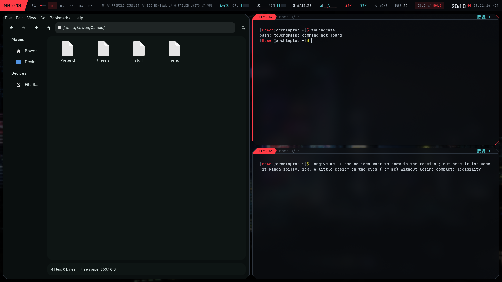
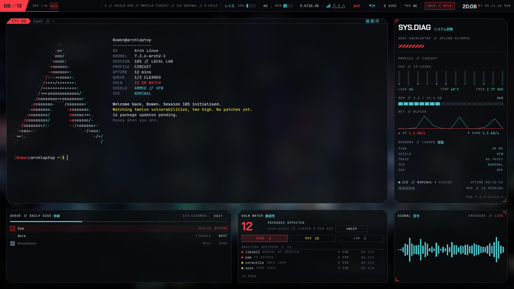
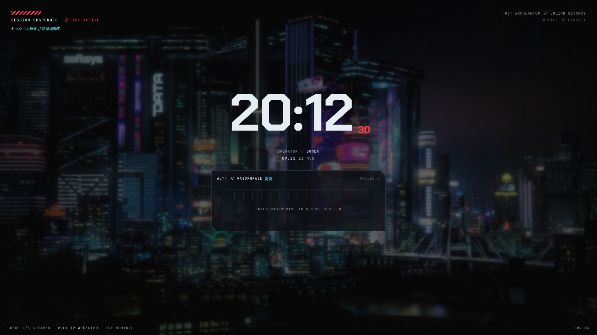

# Wrayth

A cyberpunk desktop shell for Hyprland, with a bar, a full-screen deck and a
PAM lockscreen.


*The desktop: kitty and Thunar under the bar, in the Circuit profile.*

## Install

On Arch Linux with Hyprland, run as yourself (not as root):

    bash <(curl -fsSL https://raw.githubusercontent.com/bowenbride/wrayth/main/install.sh)

It installs everything Wrayth needs, backs up any existing Hyprland config
before changing it, and asks for sudo only to install packages. Then log out
and back in.

See [what the installer does](#install-details) and how to
[read it before running it](#read-it-first). Check the
[requirements](#requirements) first.

## Features

A desktop shell for [Hyprland](https://hyprland.org), built with
[Quickshell](https://quickshell.org). It has a top bar and a full-screen
**deck**: a terminal, system diagnostics, a daily planner and a vulnerability
watch. It also has dropdowns for Wi-Fi, Bluetooth, audio, the system tray,
notifications and power profiles, a launcher, a power menu, a PAM lockscreen,
screenshots, clipboard history, an admin prompt, an editable keybind list, and
six colour profiles, with custom profiles too.

Wrayth was designed by [bowenbride](https://github.com/bowenbride) and built
with help from AI. It is a personal project, released in case it is useful to
someone else. See [Issues](#issues).

**The bar**

- Workspaces, and a scrolling ticker of firewall, profile, failed-service and
  vulnerability status.
- CPU, memory, network traffic, Bluetooth, audio and power readouts.
- The system tray: a count of tray apps, opening a list of them with each
  app's own menu redrawn in the shell's style.
- A keep-awake toggle that pauses idle locking.
- A message marker, lit when a chat app shows something unread or a
  notification hasn't been seen. It opens COMMS: the notification history,
  do not disturb, and the chat workspace.
- A clock with seconds and the date.

**The deck** (`Super + E`)

- A kitty terminal with a fastfetch banner in the profile's colours.
- SYS.DIAG: host, uplink, per-thread CPU bars, load, temperature, frequency,
  memory and a network graph.
- Daemons: small probes you choose from a library of 21. They cover network
  (ping, DNS, VPN, open ports), security (firewall, failed logins, SSH,
  USB, microphone and camera), system (battery wear, disk, clock sync,
  pending reboot) and WEATHER for a city you type (off by default; see
  [Security](#security)).
- The planner: a daily list of tagged tasks, edited in place.
- VULN WATCH: `arch-audit` results by severity, linked to the Arch security
  tracker.
- SIGNAL: a live audio spectrum from `cava` of everything on your current
  output, and the media playing: title, artist, progress and play controls,
  or a voice call with its duration. With more than one source, pick which
  one is shown.

**Profiles**

- Six preset colour profiles, applied to the shell, kitty, Hyprland's borders
  and the terminal logo.
- A live-preview picker, and custom profiles made from nine colours. Open the
  picker from the deck: see [Finding your way around](#finding-your-way-around).
- A matching wallpaper for every profile, generated locally for custom ones.
- Wallpaper pools: a set of your own wallpapers for each profile.

**The lockscreen** (`Super + L`)

- PAM authentication with a visible lockout countdown.
- No unauthenticated unlock, and it recovers by itself if its process dies.

**Effects**

- Six scanline treatments, on panels only or on everything.
- Occasional glitch effects on a schedule you set, or off.

**Audio**

- Output and input devices, with a 20-step volume and mute for each, and a
  mixer with every app playing sound.
- `Super + Shift + A` switches to the next output and names it on screen.
- Media keys control whatever is playing, and the popup shows the track.

**Screenshots** (`Print`)

- A region, the focused window (`Alt + Print`) or the whole screen
  (`Shift + Print`), saved to `~/Pictures/Screenshots` and copied to the
  clipboard. A notification shows it, with OPEN, COPY and DELETE.

**Clipboard history** (`Super + Shift + V`)

- Text and images you copied, with a filter and pinning. `Enter` pastes into
  the window you were in. Kept in memory only by default; see
  [Security](#security).

**Keybinds** (`Super + /`)

- Every key, grouped and searchable, read from Hyprland itself. Click one to
  change it; your changes go in `~/.config/wrayth/keybinds.lua`.

**Screen recording** (`Super + Shift + R`, or RECORD in the launcher)

- REGION (the screenshot selector), WINDOW or SCREEN; sound OFF (the
  default), SYSTEM, or SYSTEM + MIC; 30 or 60 frames. Saved to
  `~/Videos/Recordings` and announced with OPEN and DELETE. Stop with the REC
  chip on the bar or the same key.

**Privacy chips**

- At the ticker's left edge, only while active: REC (with the time), and
  SHARE, MIC and CAM while an app is capturing the screen, the microphone or
  the camera. Click SHARE, MIC or CAM to see which app.

**Wallpapers per screen, and video**

- In MANAGE WALLPAPER POOLS each profile has SCREENS: SAME ON ALL, or PER
  SCREEN with a tile per monitor. Video files (`.mp4`, `.webm`, `.mkv`,
  `.mov`) join the library tagged LIVE; they play muted on an empty
  workspace, pause when a window covers them or anything is fullscreen, and
  hold their first frame on battery.

**Overview** (`Super + Tab`) and **window switcher** (`Alt + Tab`), both
optional and **off by default**: turn them on in the SYSTEM page's WINDOWS
section. While off, Wrayth binds neither key (so your own config's binds keep
them) and loads nothing for them.

- OVERVIEW shows the current page's five workspaces as cards, each window
  drawn where it is with its badge and title; drag a window onto another
  workspace to move it. Open special workspaces are chips in the sixth place.
- Hold `Alt` and tap `Tab` to go through every window, most recent first;
  `Shift + Tab` goes back; let go to focus. Choosing a window on a regular
  workspace closes the deck (or any special workspace) first.

**Launcher modes**

- `=` calculates (arithmetic, powers, brackets, unit conversions such as
  `5 km to mi`); a plain sum answers without the `=`. `Enter` copies.
- `:` searches emoji by name; `Enter` copies.
- `>` runs a command in kitty or in the background -- never as root. Recent
  commands are kept the way the clipboard history is.

**Calendar, input methods and night light**

- Click the clock for the month. Weeks start on Monday.
- With two or more keyboard layouts, or fcitx5, the bar shows the mode (`EN`,
  `あ`, `ア`); `Super + Space` cycles them.
- NIGHT LIGHT in the power dropdown warms the screen through `hyprsunset`, by
  hand or between two times you set. No location is ever used.

**SYSTEM page** (in the profile picker, beside PRIVACY)

- Interface scale (per screen), reduced motion, game mode (pauses the
  visualiser, glitches and the scanline band while anything is fullscreen, and
  holds notifications), and idle timings for plugged in and on battery. Lock
  always comes before sleep. Saved to `~/.config/wrayth/system.json`.
- WINDOWS: the window switcher (Alt + Tab) and the workspace overview
  (Super + Tab), each OFF or ON, off by default. Turning one on binds its key
  at once; turning it off gives the key back to your own config (Hyprland's
  config is reloaded to restore your binds).

**Everything else**

- Wi-Fi (with AIRPLANE mode and your NetworkManager VPNs), Bluetooth, audio,
  tray, notification, power-profile and identity dropdowns from the bar. A
  lock beside the Wi-Fi readout means a tunnel is up.
- A launcher (tap `Super`) for apps, profiles, the keybind list and the
  clipboard, listing your most-used first.
- Notifications, held back while a window is fullscreen, and an on-screen
  display for volume, brightness and media.
- An admin prompt in the lockscreen's style, when an app asks for your
  password to do something as root.
- A power menu: lock, sleep, log out, reboot and power off.

## Keybinds

Wrayth's own keys, from `external/hypr-wrayth.lua`:

| Key | Action |
| --- | --- |
| `Super` (tap) | launcher |
| `Super + E` | open or close the deck |
| `Super + Shift + E` | refresh the deck terminal |
| `Super + P` | power menu |
| `Super + L` | lock the screen |
| `Super + /` | the keybind list |
| `Super + Shift + V` | clipboard history |
| `Super + Shift + A` | next audio output |
| `Super + Tab` | overview of the workspaces (optional, off by default: SYSTEM page, WINDOWS) |
| `Super + Shift + R` | record the screen, or stop recording |
| `Alt + Tab`, `Alt + Shift + Tab` | switch windows, hold Alt (optional, off by default: SYSTEM page, WINDOWS) |
| `Super + Space` | next keyboard layout or input method |
| `Print` | screenshot of a region |
| `Alt + Print` | screenshot of the focused window |
| `Shift + Print` | screenshot of the whole screen |
| `Super + 1` … `0` | go to workspace 1–10 (closes the deck first) |
| brightness keys | brightness ±5% |
| volume keys, mute | volume |
| play/pause, next, previous | the media playing |

Wrayth's keys replace any earlier bind on the same key, so no key does two
things. **To change a key,** press `Super + /`, click the key shown beside an
action and press the new keys. `Escape` cancels. If the new keys are already
in use, the list says by what and offers `SWAP`. A changed key shows in the
accent colour with `RESET` beside it. Changes are saved in
`~/.config/wrayth/keybinds.lua`, which updates never touch; `OPEN KEYBINDS
FILE` opens it in your editor. Keys set in your own Hyprland config are listed
as `FROM YOUR CONFIG` and changed there, not here. The list warns you before
you leave the lockscreen or the power menu without a key. `external/hypridle.conf` locks the screen on idle and before sleep.
The everyday [window keys](#window-keys) come with Wrayth's complete Hyprland
config. Some things, like the profile picker, have no key; see
[Finding your way around](#finding-your-way-around).

## Finding your way around

Much of Wrayth opens by clicking a label rather than a button. These are the
ones that are easy to miss.

**The profile picker** has no keybind. There are two ways in:

- Press `Super + E` to open the deck, then click `PROFILE // <NAME>` in the
  SYS.DIAG panel (top right). This opens the picker.
- Or tap `Super` for the launcher and type a profile's name. This applies the
  profile directly, without the picker.

**Inside the picker:**

- Click a card, or use the arrow keys, to preview a profile live.
- Click the same card again, press `Enter` or press `APPLY` to keep it.
- `Escape` or `REVERT AND CLOSE` closes the picker and undoes the preview.
- `+ NEW CUSTOM` (the last card) makes a custom profile.
- **PRIVACY** (clipboard history) is a button beside EFFECTS; see
  [Security](#security).
- **SYSTEM** (scale, motion, game mode, idle) is a button beside PRIVACY.
- Custom profiles have edit and delete buttons on their card; presets don't.
  `Delete` also removes the selected custom profile after asking.
- **EFFECTS** (scanlines and glitches) is a button in the picker.
- **Wallpapers** are in the picker's wallpaper column: `DYNAMIC` or `STATIC`,
  the folder, and `MANAGE WALLPAPER POOLS`.
- In a sub-screen (the editor, effects or pools), `Escape` goes back one step.

**The bar.** Most readouts open something when clicked:

| Click | Opens |
| --- | --- |
| the ID block at the far left (e.g. `AB//01`) | the identity editor: set both halves (two letters or digits each) |
| a workspace number | that workspace |
| the network readout | the Wi-Fi dropdown (networks, then `WI-FI SETTINGS`) |
| the Bluetooth readout | the Bluetooth dropdown (devices, `DISCOVERY`) |
| the speaker readout (`SPKR`, `HEAD`, `HDMI`, a headset's model code) | the audio dropdown: outputs, inputs, volume, mute and `MIXER` |
| the tray icon | the tray dropdown: click an app to open it, right-click for its menu |
| `PWR` | the power-profile dropdown, with NIGHT LIGHT |
| the clock | CALENDAR |
| the input mode (`EN`, `あ`) | INPUT: layouts and input methods |
| `IDLE // AUTO` / `IDLE // HOLD` | toggles keep-awake: `HOLD` stops idle locking |
| the message icon | COMMS: one row per app; click a notification to open it; the bell is Do Not Disturb |
| empty bar space, or `Escape` | closes an open dropdown |

The message icon's dot means a chat app (Discord, Vesktop, WebCord or
Equibop) shows something unread, or a notification hasn't been seen yet. It
never reads the message. `OPEN COMMS WORKSPACE` in COMMS toggles a Hyprland
special workspace named `communication`. Wrayth doesn't move your chat client
there, so add a window rule if you want this to work.

When the bar runs short of room, the Bluetooth readout shrinks to its icon
first, so the ticker keeps a readable width.

**The deck** (`Super + E`):

- **Daemons:** click the `DAEMONS // LOADED` heading in SYS.DIAG to open the
  library, and tick up to five to show. Click a daemon's row to expand its
  details. The PING daemon's details let you choose which city it measures.
- **Planner:**
  - `+ ADD GIG` at the bottom adds a task;
  - the tickbox marks a task done;
  - click a task's name to rename or retag it;
  - drag the grip on the left to reorder;
  - the minus on the right removes a task.

  The planner is also a plain text file, `~/.config/wrayth/planner.txt`,
  which you can edit by hand.
- **VULN WATCH:** click a package to expand it.
  - `OPEN ADVISORY` opens the Arch security tracker's page.
  - `FIX` runs a full system update (`sudo pacman -Syu`) in a terminal, when a
    fixed version exists.
  - `REMOVE` uninstalls the package in a terminal, with pacman's own prompt.
    It's only offered when nothing depends on the package.
  - `SWEEP` re-runs the audit.
- **SIGNAL:** click the device name for the audio dropdown. With more than
  one player or call, chips at the top choose which one is shown (the
  spectrum always shows your current output). A call shows `OPEN CALL`, which brings its window
  forward; mute and leave stay in the app, so you're never muted without the
  app knowing.

**The power menu** (`Super + P`): use the arrow keys and `Enter`, or press the
letter shown on a tile. Reboot and power off need a second press to confirm.
`Escape` cancels that confirmation first, and a second `Escape` closes the
menu.

**The lockscreen:** type your password and press `Enter`. `Escape` clears
what you've typed.

**Screenshots:** `Print` dims the screen. Drag a box, or press `Tab` to
switch between `REGION`, `WINDOW` (click a window) and `SCREEN`. `Enter`
captures, `Escape` cancels. The selector is never in the image.

**The admin prompt** (`ADMIN ACCESS`) appears when an app asks polkit for
your password: installing software, changing system settings. It names the
program and the permission it wants. `Enter` or `AUTHENTICATE` sends your
password to polkit; `Escape` or `CANCEL` refuses.

## Credits

Small icons are [Material Symbols](https://fonts.google.com/icons) (Sharp),
by Google, under the Apache License 2.0; the SVGs and the licence are in
`assets/icons/material-symbols-sharp/`.

## More screenshots


*The deck (`Super + E`): the terminal, SYS.DIAG, the planner, VULN WATCH and
the SIGNAL spectrum.*


*The lockscreen (`Super + L`).*

## Requirements

- **Arch Linux** (or an Arch-based distro). The package count, the update
  check and the vulnerability watch use `pacman`, `checkupdates` and
  `arch-audit`. Elsewhere those readouts are blank, but the rest of the shell
  runs. Wrayth is built and tested only on Arch.
- **Hyprland 0.56 or newer, with the Lua config** (`hyprland.lua`). Wrayth's
  rules and keys are written in Hyprland's `hl.*` Lua API. A `hyprland.conf`
  setup is not edited in place. The installer replaces it with Wrayth's
  complete Lua config instead, after backing it up.
- **Quickshell 0.3.1 or newer** (`quickshell` in `extra`). The installer
  installs it for you, with `grim` and `wl-clipboard` for screenshots and the
  clipboard, `polkit`, and the Hyprland and GTK desktop portals for screen
  sharing and file dialogs.
- **A screen of at least 1920×1080 logical pixels.** The deck is laid out for
  1080p. On shorter screens it is clipped, not reflowed, and Wrayth shows a
  one-time notice.
  - **High-resolution screens may look small.** Wrayth's complete Hyprland
    config runs every monitor at scale 1, so on a 1440p or 4K screen
    everything is drawn at 1080p pixel sizes. To make it larger, raise
    `scale` in the `hl.monitor` block of `~/.config/hypr/hyprland.lua`. Keep
    at least 1920×1080 logical pixels: on a 4K screen, scale 2 gives exactly
    that.

## Install details

One command, run as yourself (not as root):

    bash <(curl -fsSL https://raw.githubusercontent.com/bowenbride/wrayth/main/install.sh)

### Read it first

**Prefer to read it first?** Clone the repository, read the installer, then
run it from the clone:

    git clone https://github.com/bowenbride/wrayth.git ~/wrayth-src
    less ~/wrayth-src/install.sh
    bash ~/wrayth-src/install.sh --source ~/wrayth-src

### After installing

Log out and back in to Hyprland. On a text console, log in and type
`start-hyprland`. The installer asks nothing it does not have to, and there is
nothing to edit afterwards.

What the installer does:

1. **Installs missing packages** from the official Arch repositories. It
   prints one `sudo pacman -S --needed ...` command, then runs it. That is the
   only step that runs as root, and sudo asks for your password.
2. **Fetches Wrayth** into `~/.config/quickshell/wrayth`, from this
   repository or from `--source`. Nothing else is downloaded.
3. **Sets up the rest as you:**
   - the `wrayth-*` helpers in `~/.local/bin`, `wrayth-update` included;
   - the kitty and hypridle configs, as files of your own to edit;
   - the bundled Chakra Petch font;
   - the six profile wallpapers in `~/Pictures/wallpapers/wrayth`;
   - one line in `~/.bashrc`;
   - Hyprland. With no config of your own, only Hyprland's generated default,
     or an old `hyprland.conf`, it installs Wrayth's complete setup and first
     moves whatever was in `~/.config/hypr` to a dated backup. With your own
     `hyprland.lua`, it backs that file up and adds one line that loads Wrayth.

Every file it replaces is backed up first, and the closing summary says where.
Running it again is safe; see [Updating](#updating).

## Updating

    ~/.local/bin/wrayth-update

This is the recommended way to update. It works from your existing install:

1. It fetches the latest version from this repository into
   `~/.config/quickshell/wrayth`.
2. It shows your installed version, the new one and a list of what changed,
   then asks before changing anything. If you're already up to date, it says
   so and stops.
3. It installs any newly required packages the same way the installer does,
   with one `sudo pacman -S --needed ...` command shown for you to approve.
4. It adds any new helpers, fonts and wallpapers.
5. It restarts the shell so the update takes effect. If the screen is locked,
   it doesn't restart; it tells you to log out and back in instead.

Updating never touches your data in `~/.config/wrayth`,
`~/.local/state/wrayth` or `~/.cache/wrayth`.

**Your edited configs are kept.** This covers the configs Wrayth installs:
`kitty.conf`, kitty's `tab_bar.py`, `hypr-wrayth.lua`, `hypridle.conf`, and
Wrayth's complete `hyprland.lua`.

- **If you haven't edited one,** it's replaced with the new version.
- **If you've edited one,** yours is left exactly as it is. When Wrayth's
  version has changed, the new one is saved beside yours as
  `<file>.wrayth-new`, and the summary lists each one. Compare them with
  `diff` and take what you want.

**When it stops.** `wrayth-update` makes no changes if:

- Wrayth's own folder contains changes you've made;
- Wrayth was installed from a plain folder rather than from git.

In both cases it explains what to do.

**Re-running the install command also works,** and is safe. It keeps your
data and follows the same rules for edited configs. Use it if you installed
from a plain folder, or if you're updating from the first release. The first
release linked some configs into Wrayth's folder, and re-running the
installer turns them into files of your own, keeping any edits.

**No automatic checks.** Wrayth never checks for updates or contacts GitHub
by itself. Updates happen only when you run one of these commands.

**Versions.** The version is in the `VERSION` file, and each release is
tagged `v<version>`. `wrayth-update` shows the installed and available
versions. The first release had no version number.

### Optional packages

Each of these features degrades gracefully without its package:

    sudo pacman -S --needed cava fastfetch pacman-contrib arch-audit \
        brightnessctl power-profiles-daemon bluez bluez-utils hypridle ufw xdg-utils

| Package | Powers | Without it |
| --- | --- | --- |
| `cava` | the SIGNAL spectrum | a flat spectrum |
| `fastfetch` | the deck terminal's banner | a plain shell |
| `pacman-contrib` | the update count | PKG reads 0 |
| `arch-audit` | the VULN WATCH panel | `NOT INSTALLED` |
| `brightnessctl` | brightness keys | no brightness control |
| `power-profiles-daemon` | the power-profile readout and switch | blank |
| `bluez`, `bluez-utils` | the Bluetooth dropdown | no Bluetooth |
| `hypridle` | lock on idle and before sleep | no automatic lock |
| `hyprsunset` | NIGHT LIGHT | the switch does nothing |
| `wf-recorder` | screen recording | RECORD says it is not installed |
| `inotify-tools` | the CAM chip for apps that open the camera directly | CAM shows only PipeWire camera streams |
| a firewall (`ufw`, `nftables`, `firewalld`) | the SHIELD readout | `NOT CONFIGURED` |
| `xdg-utils` | opening the wallpaper folder and screenshots | the buttons do nothing |

## Profiles

A profile sets every colour in the shell. Kitty, the Hyprland borders, the
deck's logo and the wallpaper follow it.

| Profile | Character |
| --- | --- |
| **Circuit** | the balanced default: red and teal |
| **Sodium** | streetlight yellow on warm grime |
| **Prism** | magenta and cyan on violet-black |
| **Redline** | chrome and red on black |
| **Oxide** | rust and amber |
| **Cobalt** | cold blue on midnight steel |

To open the **profile picker**, press `Super + E` for the deck, then click
`PROFILE // <NAME>` in the SYS.DIAG panel. Profiles are also listed in the
launcher. Click a card to preview it live, and click again or press `APPLY`
to keep it. `REVERT AND CLOSE` undoes a preview.

**Custom profiles.** In the picker, choose `+ NEW CUSTOM`. You set nine
colours: ground, panel, hair, text, bright, dim, signal, accent and alert.
Wrayth derives the rest the same way the presets do. A custom profile's
wallpaper is the Circuit wallpaper recoloured to its accent and signal. This
is done locally with a colour lookup table, with no network and no generative
model. Custom profiles are saved in `~/.config/wrayth/custom-profiles.json`.

**Wallpapers.** By default a profile switch changes the wallpaper too
(`DYNAMIC`). Switch it to `STATIC` in the picker's wallpaper column to keep one
wallpaper throughout. The folder defaults to `~/Pictures/wallpapers`.

## Window keys

Window keys, from Wrayth's complete Hyprland config (`external/hyprland.lua`,
installed only when you had no config of your own):

| Key | Action |
| --- | --- |
| `Super + Q` | open kitty |
| `Super + C` | close the window |
| `Super + V` | float or tile the window |
| `Super + F` | fullscreen |
| `Super + J` | toggle the split direction |
| `Super + arrows` | move focus |
| `Super + Shift + 1` … `0` | move the window to a workspace |
| `Super` + left drag / right drag | move / resize a window |
| `Super` + scroll | next / previous workspace |
| `Super + Shift + M` | exit Hyprland |

## Your own Hyprland settings

With Wrayth's complete setup, keep your own keys, window rules, input settings
and start-up programs in `~/.config/hypr/overrides.lua`. Create it if it's not
there. It's loaded last, so it applies over Wrayth's config, and updates never
touch it. Leave `hyprland.lua` itself unedited, so updates can keep replacing
it with Wrayth's new version.

```lua
-- ~/.config/hypr/overrides.lua
hl.config({ input = { kb_layout = "gb", follow_mouse = 0 } })
hl.bind("SUPER + W", hl.dsp.exec_cmd("firefox"), { description = "Open Firefox" })
hl.window_rule({ match = { class = "pavucontrol" }, float = true })
hl.on("hyprland.start", function() hl.exec_cmd("nm-applet") end)
```

- A key that Wrayth's config already uses needs `hl.unbind("KEYS")` first,
  or pressing it does both.
- To move one of Wrayth's own keys, use the keybind list (`Super + /`) instead.
- Give your binds a `description`. The keybind list shows them under that
  name, as `FROM YOUR CONFIG`.

## Effects

Open the profile picker and choose **EFFECTS**. Settings are saved in
`~/.config/wrayth/effects.json`.

**Scanlines**

- **Treatment:** `NONE`, `FINE FAINT`, `FINE STRONGER`, `WIDE`,
  `FINE + ROLLING BAND` or `FULL CRT`.
- **Coverage:** `PANELS ONLY` or `EVERYTHING`.
- **With `EVERYTHING`**, you can also turn on:
  - `EXCLUDE WINDOW CONTENT`, which keeps the lines off your apps;
  - `EXCLUDE FULLSCREEN`, which removes them over fullscreen windows.

The rolling band and full CRT cost a little more GPU time than plain lines, and
`EVERYTHING` costs more than `PANELS ONLY`.

**Glitches.** These are brief interference effects on the shell's surfaces.

| Setting | Interval |
| --- | --- |
| `OFF` | none |
| `RARE` | a random interval of 60–180 s |
| `NORMAL` | a random interval of 30–90 s (the default) |
| `CUSTOM` | a random range (`FROM`/`TO`) or a fixed interval (`EVERY`), 2–3600 s |

You can also choose which effects are in the pool, and how many play per
glitch.

## Security

**The lockscreen** uses Wayland's `ext-session-lock` protocol. It checks your
password with PAM, using Wrayth's own PAM stack in `assets/pam.d/passwd`:
`pam_faillock` around `pam_unix`. Nothing is installed under `/etc`.

- There is **no unauthenticated unlock**: no IPC command, no logind hook and no
  recovery tool can open the session. The only way in is your password.
- If the lockscreen process dies, the compositor keeps the session locked.
  Wrayth's supervisor starts a new lockscreen, which takes the lock over.
- PAM runs in a separate process, so a slow or hung PAM check cannot freeze the
  lockscreen.

**Threat model.** The lockscreen protects your session from someone at the
keyboard and from other users of the same machine. It cannot protect you from
software already running as you, and no screen locker can: such a program can
read your files and could end or replace any lock client. Wrayth turns on
Hyprland's `misc:allow_session_lock_restore` so a crashed lockscreen can be
replaced. That option only lets a new lockscreen take over a held lock and
never unlocks one. Any program running as you could turn it on anyway.

**Failed passwords lock your whole account.** After three wrong passwords in a
row, `pam_faillock` locks your account for ten minutes (by default,
`deny=3` and `unlock_time=600`). The lockout is per account, not per program.
While it lasts, `sudo` and console logins refuse your *correct* password too.
The lockscreen shows `ACCOUNT LOCKED // RETRY IN m:ss` and does not send
passwords to PAM during the countdown. Wait it out **without typing passwords
anywhere**, because every wrong attempt can restart the ten minutes.

**The admin prompt** is Wrayth acting as your session's polkit agent. It
only draws the question: the password goes to polkit's own helper, exactly as
with any other agent, and Wrayth never sees whether it was right. Only one
agent can be registered per session. If another (such as `polkit-gnome` or
`hyprpolkitagent`) is already running, Wrayth says so once and leaves that one
in charge.

**Notification history** is kept in memory only and never written to disk.
It's cleared when you log out, or with `CLEAR ALL`. While a window is
fullscreen, notifications go quietly to the history, and you get one summary
afterwards. Critical ones still appear.

**Clipboard history** is set in the profile picker's `PRIVACY` page:

- `HISTORY`: `MEMORY ONLY` (the default: gone at logout, never on disk),
  `SAVE TO DISK` (kept in `~/.local/state/wrayth/clipboard.json`, readable
  only by you) or `OFF`. Leaving `SAVE TO DISK` deletes the file.
- `ON LOCK`: `KEEP` or `CLEAR` the history when the screen locks.
- Copies a password manager marks as sensitive are never recorded. The
  content isn't even read.
- Limits: 100 entries, 20 of them pinned; text up to 1 MiB each; images up
  to 5 MiB each, 20 at most. Larger copies are skipped.

**Everything else:**

- The deck's kitty remote-control socket is private to you.
- Untrusted text such as notifications, Wi-Fi names and advisories is shown as
  plain text, never as markup.
- Wrayth's folders are owner-only.
- The shell's own network traffic is:
  - the PING readout, which measures latency to a cloud endpoint you choose
    (default: AWS `us-east-1`);
  - a ping to your router for the uplink readout;
  - `checkupdates` and `arch-audit` if they are installed;
  - **only if you add the WEATHER daemon** (it is off by default): the city
    you type, sent once to Open-Meteo's geocoding API
    (`geocoding-api.open-meteo.com`), then its coordinates to Open-Meteo's
    forecast API (`api.open-meteo.com`) every 30 minutes. No account or key,
    and your location is never looked up. Removing the daemon stops it.

  The installer and `wrayth-update` contact only this repository and pacman's
  mirrors, and only when you run them.

## Recovering a stuck lockscreen

None of the steps below adds a password-free way in. Each ends with you typing
your password on a Wrayth lockscreen, or with the session ending.

**Usually there is nothing to do.**

- **After switching to a text console and back** (`Ctrl+Alt+F3`, then
  `Ctrl+Alt+F1`), the lockscreen accepts typing again within about a second.
- **If the lockscreen process dies**, a new one starts within a second. For
  that second you may see Hyprland's own "lock screen app died" screen. This is
  expected: the session stays locked the whole time.
- If the lockscreen cannot get the keyboard back after three tries, it shows
  **KEYBOARD LOST // RECOVER FROM A CONSOLE**.

**If it is still stuck:**

1. Press `Ctrl+Alt+F3` and log in with your username and password.
2. Run:

        ~/.local/bin/wrayth-recover

   It restarts the shell, and the new shell takes the lock back. When it
   reports `wrayth has taken the lock back`, it tells you which key returns you
   to the desktop, usually `Ctrl+Alt+F1`.
3. Press that key and type your password. Your windows are all still there.

**Last resort: end the session.** This **closes every window and loses
anything unsaved.** Use it only if `wrayth-recover` says it could not recover.
On the text console:

1. Run `loginctl list-sessions`. Find the row whose **TTY** is your desktop's
   console (usually `tty1`) and note its **SESSION** number.
2. Run `sudo loginctl terminate-session NUMBER`, with that number.
3. Press `Ctrl+Alt+F1` and log in again.

## Uninstalling

    ~/.config/quickshell/wrayth/install.sh --uninstall

This removes what the installer added:

- the helper links;
- the font;
- its line in `~/.bashrc`;
- its kitty and Hyprland configs, but only ones you haven't edited (edited
  ones are left where they are);
- its line in your `hyprland.lua`, or its complete Hyprland config, which is
  moved aside rather than deleted.

It then offers to put back everything it backed up. Packages are left
installed. It also leaves your Wrayth data and the checkout in place. To remove
those too:

    rm -rf ~/.config/quickshell/wrayth ~/.config/wrayth \
           ~/.cache/wrayth ~/.local/state/wrayth

## Known limitations

- Arch Linux only for the package, update and vulnerability readouts.
- Hyprland with the Lua config only.
- The deck targets 1920×1080 or larger. Smaller screens are clipped, not
  reflowed.
- **Multiple monitors work.** Each screen gets its own bar and wallpaper, and
  each bar shows its own monitor's workspaces. The following open on one
  screen only, the focused one:
  - the deck;
  - the launcher, power menu and profile picker;
  - the bar dropdowns;
  - the keybind list, the clipboard and the screenshot selector;
  - notifications;
  - the volume and brightness popup.

  The lockscreen covers every screen, including one plugged in while locked.
  The admin prompt dims every screen and asks on the focused one.
- CPU temperature needs an Intel `coretemp`, AMD `k10temp`/`zenpower` or ARM
  `cpu_thermal` sensor. Without one, no temperature is shown.

## Contributing

[DESIGN.md](DESIGN.md) covers the design rules, the colour logic, the profiles
and how the shell is organised. Read it before changing a panel.

## Reporting a bug

Please open an issue with what happened, what you expected, and the output of
these commands:

1. **Hyprland and Quickshell versions:**

        hyprctl version | head -1
        qs --version

2. **Install mode** (`complete`, or `add` if Wrayth was added to your own
   `hyprland.lua`):

        grep MODE ~/.local/state/wrayth/install.env

3. **Monitors and scale:**

        hyprctl monitors | grep -E '^Monitor|scale:'

4. **The shell's log**, run straight after the problem happens:

        qs -c wrayth log | tail -40

   The log records things like why each bar dropdown closed, so it often shows
   the cause directly.

## Issues

Wrayth is a personal project. **Bug reports are welcome.** Please include your
Hyprland and Quickshell versions, your screen size and scale, and what you
expected to happen; see [Reporting a bug](#reporting-a-bug). There are **no
support guarantees**: issues are looked at when time allows, and some may not
be fixed.

## Licence

GPL-3.0. See [LICENSE](LICENSE). The bundled Chakra Petch font is under the
SIL Open Font License 1.1 (`assets/fonts/chakra-petch/OFL.txt`).
